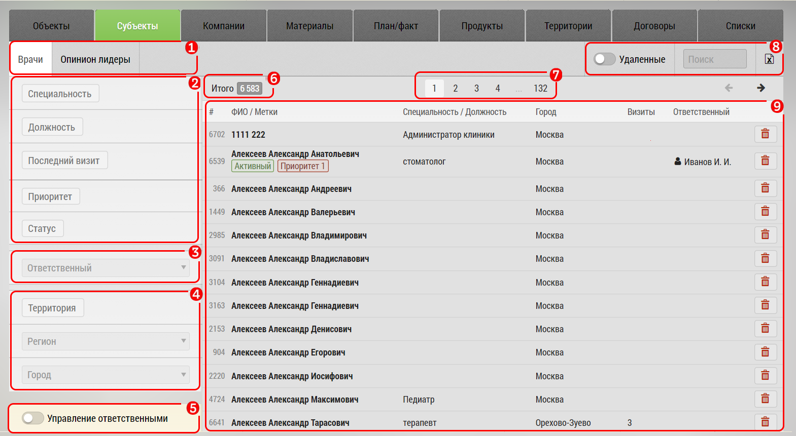

## Управление субъектами. Описание элементов интерфейса и возможностей

Вкладки управления субъектами (например врачами и ОЛ) предназначены для просмотра базы врачей, экспорта, поиска и фильтрации.

Интерфейс управления субъектами:

1. Количество элементов
2. Фильтр по [сотруднику](database-user.md)
3. Фильтр по [географическому расположению](database-geo.md)
4. Текстовый фильтр по ФИО
5. Кнопку [экспорта](database-export.md)
6. Поле с основной информацией
7. Фильтры по специальности, потенциалу, лояльности

Поле с основной информацией[6] содержит:
- ФИО субъекта
- Должность
- Специальность
- Город
- Количество визитов
- Кнопку "Удалить" - для удаления субъекта

По нажатию на строку в поле [6] можно перейти к [редактированию субъекта](database-subject-edit.md).
