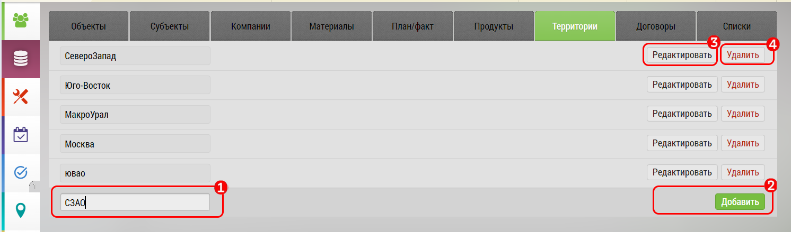

## Территории. Добавление

Для создания территории перейдите на [вкладку территории](database.md) [5].

- Вбейте название [1]
- Нажмите "Добавить" [2]

Чтобы отредактировать Территорию нажмите "[редактировать](database-territory-edit.md)" [3], напротив нее.
