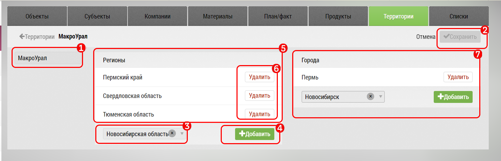

# Территории. Редактирование

Чтобы отредактировать территорию: 

- Перейдите на вкладку [Территории](database.html) `5`
- Выберите нужную территорию, и нажмите кнопку "Редактировать"

- Измените название в поле `1` и сохраните изменения кнопкой `2`
- Найдите в списке нужную область (регион) `3`
- Нажмите кнопку "Добавить" `4`
- Регион появится в списке `5`
- Удалить ненужный элемент можно кнопкой "Удалить" `6`

Регионы сохраняются автоматически.

Города добавляются и редактируются аналогично.
