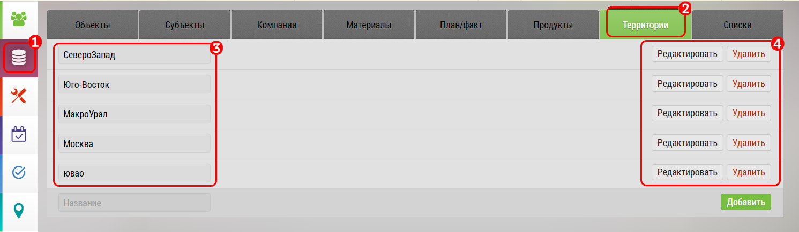

# Территории. Описание элементов интерфейса и возможностей

Территория - формируемое самостоятельно объединение регионов, городов, округов.

Позволяет объединять, несколько регионов чтобы сформировать макрорегион.

Например, Урал:
- Пермский Край
- Свердловская область
- Челябинская область

И потом, учитывать ее, как единое целое с точки зрения базы или статистики.

По территории можно фильтровать базу объектов и субъектов. 
Территорию можно использовать при просмотре статистики и формировании отчетов.

`1` Выбрать вкладку "База данных"

`2` Выбрать вкладку Территории

`3` Список заданных территорий

`4` Кнопки изменений территорий

Территории можно:
 - [создавать](database-territory-add.html) `1`, `2`
 - [редактировать](database-territory-edit.html) `3`
 - удалять `4`
