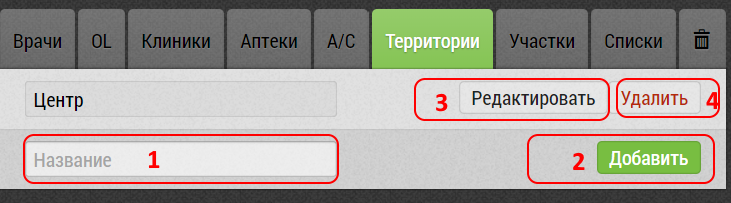

## Территории. Описание элементов интерфейса и возможностей

Территория - формируемое самостоятельно объединение регионов, городов, округов.

Позволяет объединять, несколько регионов чтобы сформировать макрорегион.
Например, Урал:
- Пермский Край
- Свердловская область
- Челябинская область

И потом, учитывать ее, как единое целое с точки зрения базы или статистики.

По территории можно фильтровать базу объектов и субъектов, территорию можно использовать при просмотре статистики и формировании отчетов.

Территории можно:
 - [создавать](database-territory-add.md) [1,2]
 - [редактировать](database-territory-edit.md) [3]
 - удалять[4].
