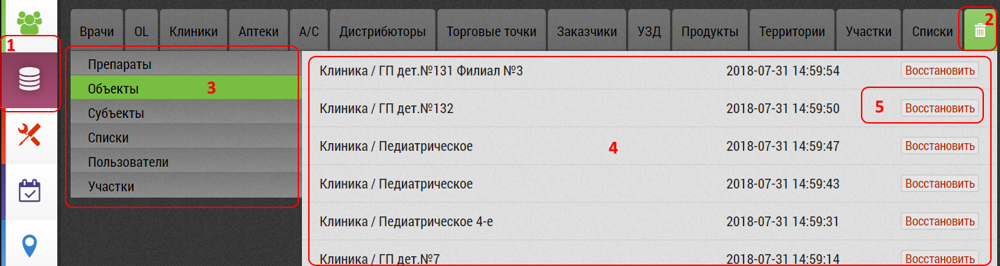

## Восстановление удаленных данных

Восстановление удаленных данных происходит в интерфейсе [корзина](database-trash.html).

Чтобы восстановить удаленные данные необходимо:

  - Перейти в "Корзину" `1`, `2`
  - Выбрать вид восстанавливаемого элемента `3`
  - Найти его в списке `4`
  - Нажать кнопку "Восстановить" `5` напротив выбранного элемента
  
Элемент восстанавливается без дополнительного запроса.
При восстановлении вы получите стандартное уведомление системы.
