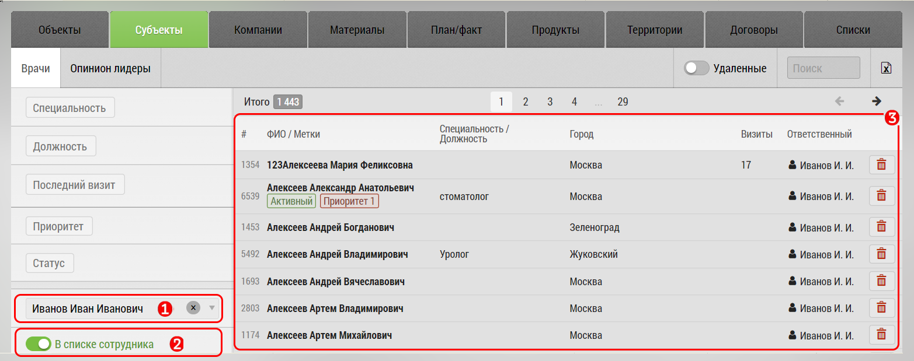

## Просмотр базы сотрудников. Активная, не активная

Чтобы просмотреть базу конкретного сотрудника необходимо:

- Перейти на [вкладку](database.md) с нужным видом объектов/субъектов (например врачей)

- Выбрать сотрудника из списка [1]
- в поле [3] отобразятся врачи сотрудника - т.е. те врачи которые добавлены в его базу

При необходимости можно переключатся между его активной и неактивной базой с помощью переключателя [2].

> !!!Активная база - это часть базы которая не отмечена как [отключенная](rep-planning-central-block-edit-multi.md)
