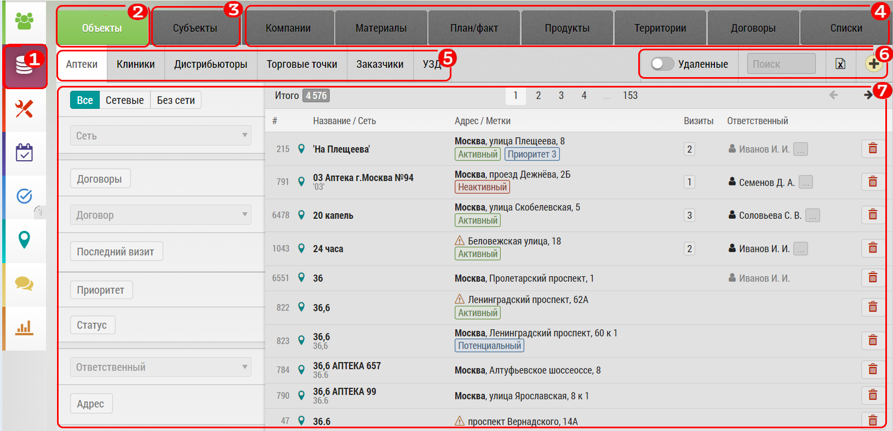

## Описание интерфейса и возможности

"Базы данных" предназначена для просмотра базы данных программы.
В "Базе данных" можно просматривать, фильтровать, экспортировать, редактировать, удалять и воостанавливать данные.

Чтобы перейти к "Базе Данных" нажмите `1`

Далее выберите нужную вкладку: 

  - субъекты`2` и объекты`3` к которым можно совершать визиты
  - продукты `4` - препараты
  - территории и участки `5` - для географического деления вне заданных областей, городов, округов
  - списки `6` - для настройки различных списков в программе, например визит-эквивалента
  - корзина `7` - где находятся удаленные элементы, откуда их можно восстановить в любой момент
  
Поле `8` зависит от конкретной выбранной вкладки (в примере - врачи).
