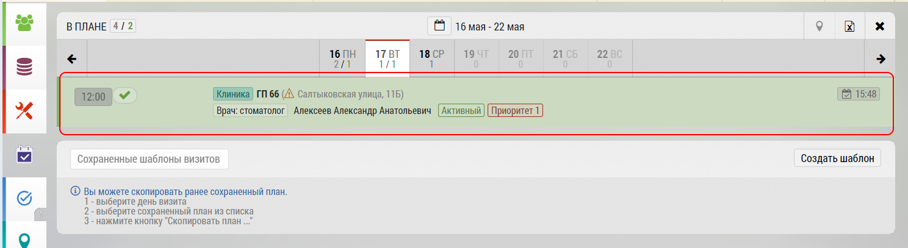
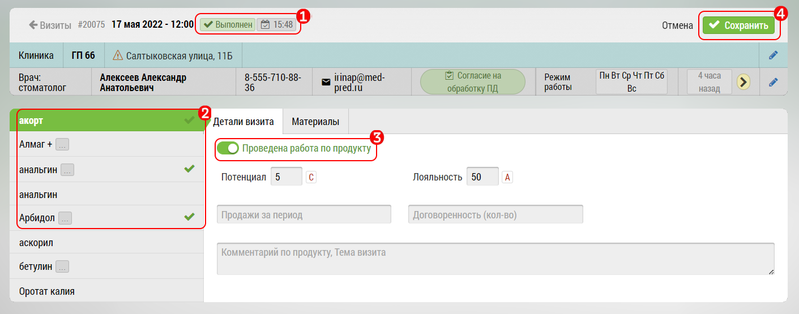
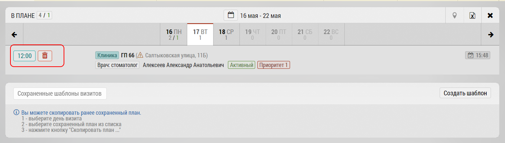

# Удаление закрытых визитов

Для того чтобы удалить уже закрытый визит необходимо перейти в Подробный план. 

Нажмите на закрытый визит, который хотите удалить.

Откроется окно визита:

Убедитесь, что визит действительно закрыт `1`

В списке препаратов `2` отключите переключатель 

"Проведена работа по продукту" по каждому наименованию, 

где есть зеленые галочки `3`

Нажмите кнопку «Сохранить» `4`

Теперь визит станет не закрытым - и вы можете его удалить, нажав на "Корзину"

 > По умолчанию Вы можете удалять закрытые визиты за последние 14 дней. Количество дней может быть сокращено или увеличено по заявке Руководителя
