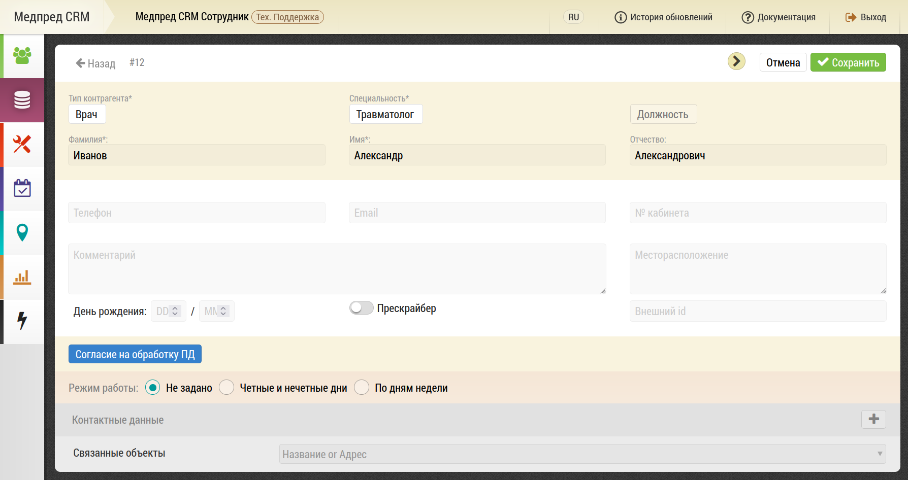
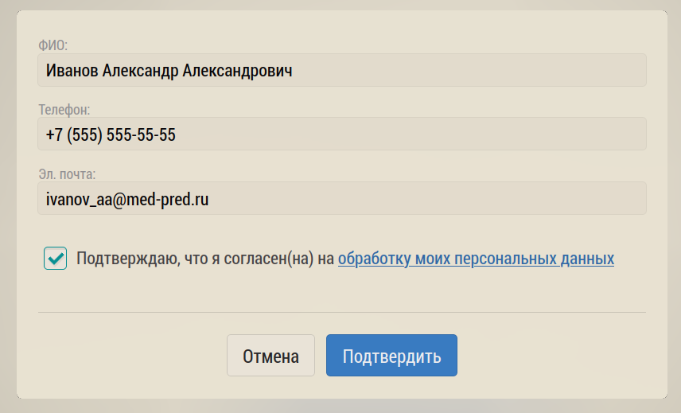
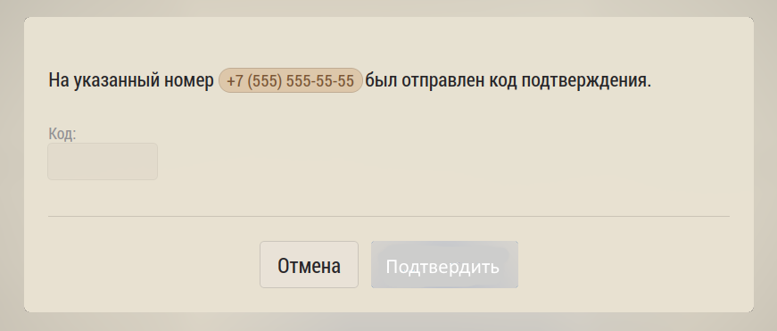
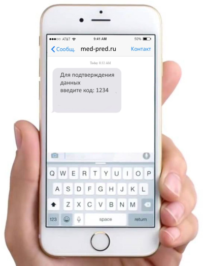
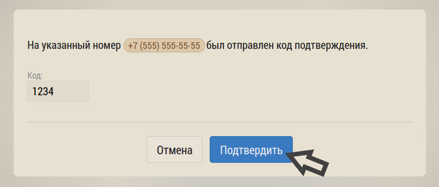
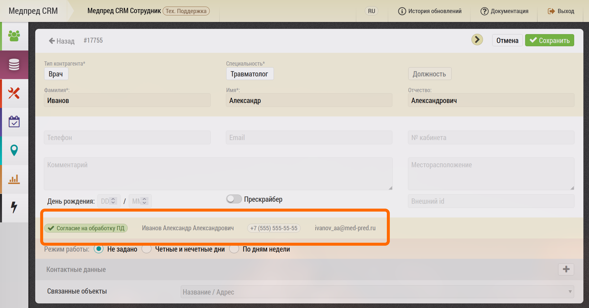

# Модуль верификации врача

> Данная возможность не включена в базовый набор и настраивается отдельно

Модуль верификации врача позволяет получить подтверждение на обработку персональных данных врача в программе, используя смс

В карточке врача выберите кнопку "Согласие на обработку ПД"

Откроется окно внесения данных врача. Врач, с планшета или смартфона МП - заполняет и подтверждает свои персональные данные: ФИО, телефон, е-мейл.

Из программы на указанный телефон врача отправляется СМС с кодом подтверждения:

На телефон врача приходит код

Врач вводит код и подтверждает данные

Врач верифицирован, согласие получено

