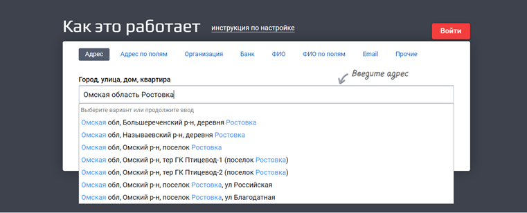

# Адрес объекта распознается в другом регионе / городе

Если адрес объекта указан неверно или не точно, то программа ищет наибольшее совпадение адреса и может подставлять другой город или регион.

В этом случае проверьте адрес объекта:

1. Перейдите на https://dadata.ru/suggestions/#address, скопируйте и вставьте адрес в строку поиска:

2. Начните по-порядку набирать сначала город, улицу, потом дом, строение – выбирайте из списка предложенных

3. Скопируйте адрес в программу, сохраните
4. Проверьте, что адрес на карте в программе Медпред соответствует той точке, где фактически должен быть

> Адрес будет соответствовать ФИАСу

> Иногда программа может не распознавать корпуса и строения по заданному адресу объекта, в этом случае сохраните адрес с точностью до дома, и вручную измените геометку на карте, разместив ее на нужном строении.