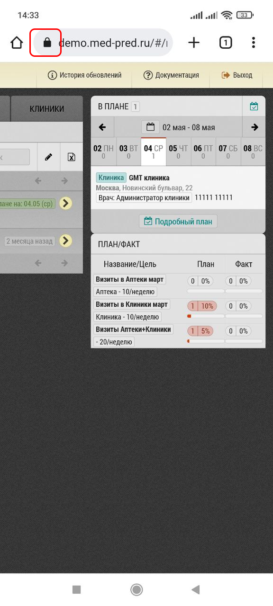
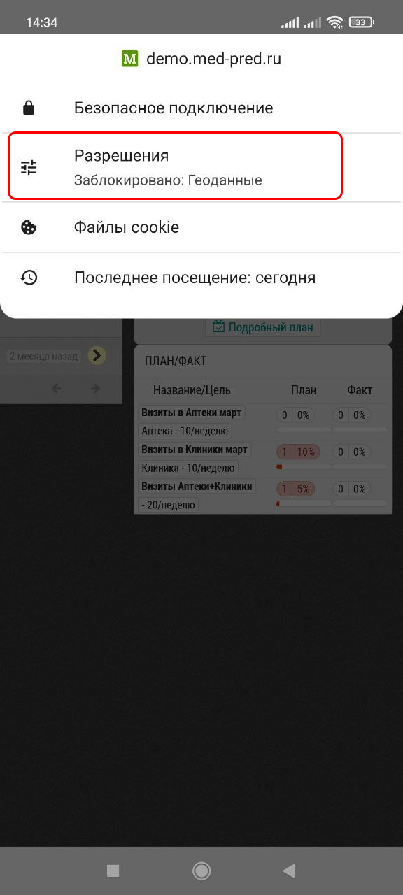
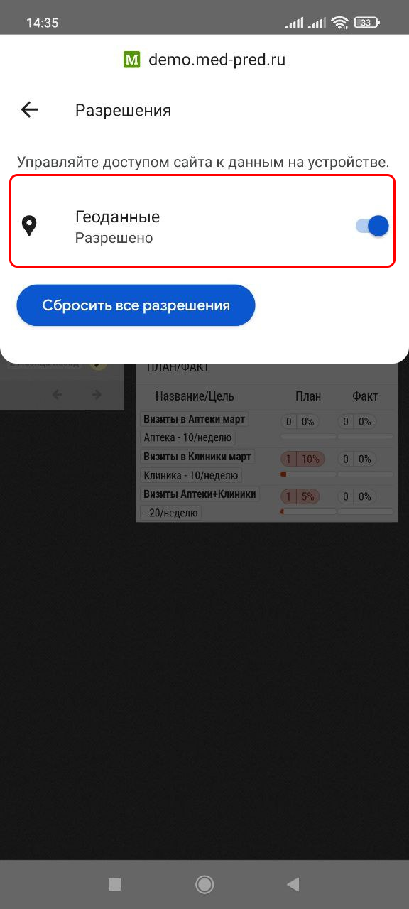
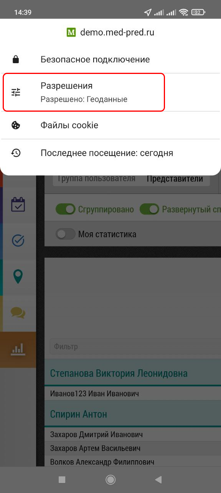

# Как включить геолокацию на смартфоне или планшете

Вы можете включить или отключить геолокацию на любом устройстве. 
Для этого в строке браузера нажмите на значок:

Откроется окно с основными сведениями о странице:

Перейдите в настройки, переключите в положение "Разрешено"

О том что геолокация включена, указывает надпись:

> Для разных устройств интерфейс может незначительно отличаться
