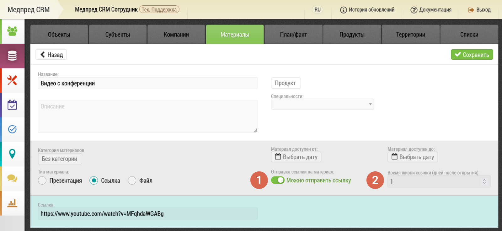
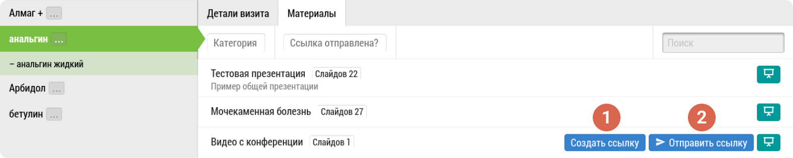
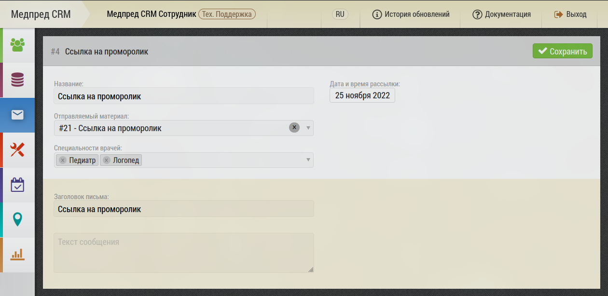
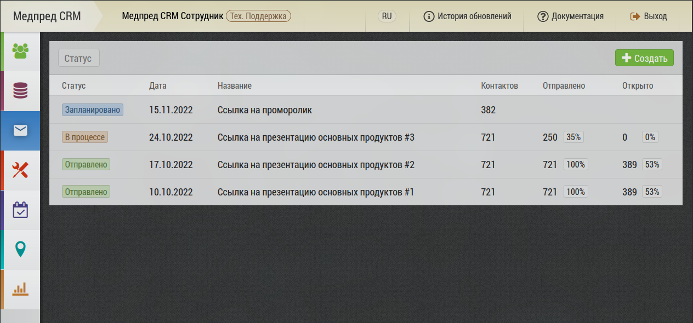

# Модуль маркетинговых коммуникаций 

Отправка презентаций и документов на электронную почту

> Данная возможность не включена в базовый набор и настраивается отдельно

## Редактирование материала (презентации)

Для того что бы презентацию или другой материал можно было бы отправить на почту, необходимо в форме редактирования этого материала установить переключатель  `1`  "Можно отправить ссылку"

При активации данного параметра становится доступным параметр: `2` “Время жизни ссылки (дней после открытия)”
Данный параметр отвечает за кол-во дней когда ссылка может быть повторно открыта после первого открытия.
Если задан “0” то ограничений по времени жизни ссылки - нет.

> Так же важно заметить что если задана дата доступности материала, то при открытии ссылки после этой даты, врач увидит сообщения что ссылка уже не существует, при этом не важно открывал он эту ссылку ранее или нет.

## Отправка ссылки на презентацию

> Отправка ссылки возможна только если врач дал согласие на обработку персональных данных. Для этого в форме редактирования врача должен быть установлен соответствующий переключатель.
> 
> Так же у врача должен быть задан e-mail адрес.

Для отправки ссылки на презентацию или материал необходимо в форме итогов визита, на вкладке "Материалы", нажать на кнопку `2` "Отправить ссылку".

Так же если у врача нет e-mail адреса или требуется отправить ссылку используя мессенджер, можно создать ссылку `1`  после чего появится кнопка с возможностью скопировать ссылку для отправки вручную.

# Добавили дополнительный инструмент к Модулю маркетинговых коммуникаций – Модуль рассылок

Модуль рассылок позволяет создавать и отправлять массовые рассылки из программы Медпред CRM врачам, а так же отследить количество просмотренных писем и получить подробный отчет по каждому отправленному письму (отправлено, просмотрено, открыто)
 

Создавать рассылку и отслеживать статус можно в разделе «Рассылки» Рассылка может быть создана для различных групп (специализаций врача)

