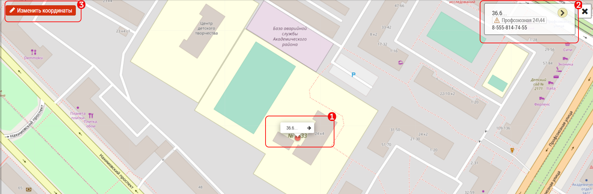
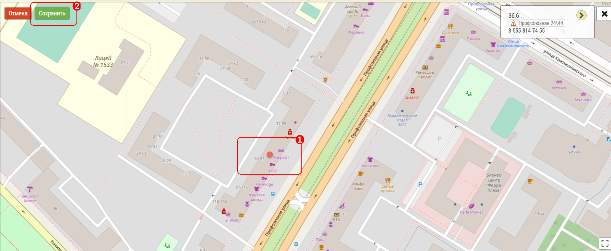

# Как изменить точку объекта

Если точка геолокации отображается на карте неверно, и программа пишет вам что до объекта более 150 м, измените координаты на карте Медпред

Для этого нажмите на точку и название прикрепленное к этой точке `1`

Откроется блок `2` с названием и адресом клиники.

Нажмите `3` Изменить координаты

Найдите на карте место - там где фактически должна быть клиника.

1. Переставьте точку вручную на новое место
2. Нажмите кнопку "Сохранить"

Так же можно воспользоваться помощью в разделе [изменение координат объекта](map-change-object-latlng.html)
