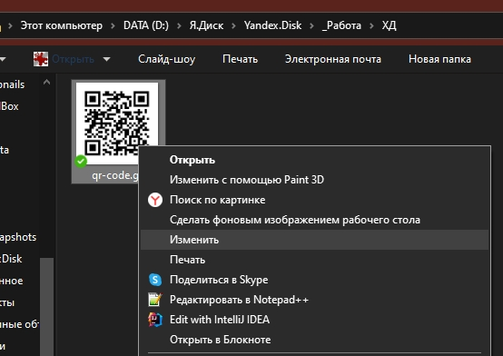
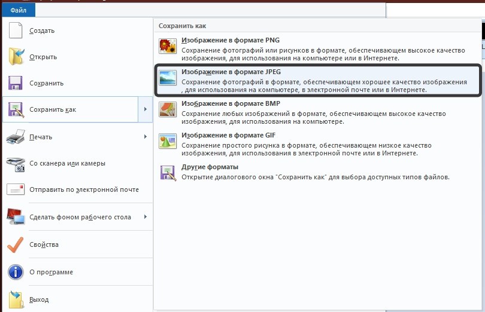
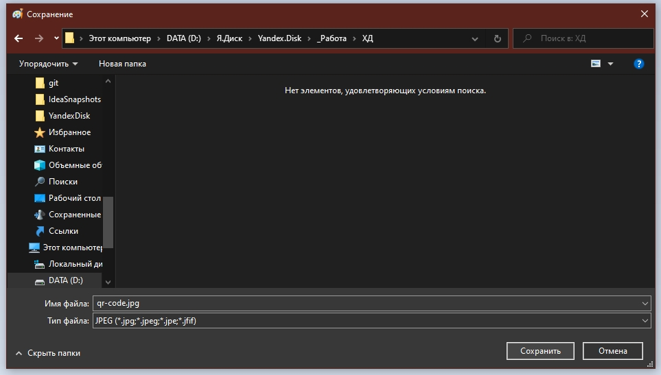

# Загрузка GIF в Презентацию (Материалы)

## Конвертация графических файлов в JPEG / PNG

Для того , чтобы загрузить в Презентации файл, формата GIF, необходимо:

1. Найдите файл, который нужно преобразовать, нажмите на него правой кнопкой и выберите «Изменить»

2. Откроется графический редактор Paint. В нем нужно открыть меню «Файл» и навести курсор на «Сохранить как».В выпадающем окне выберите необходимый формат картинки, в нашем случае «Изображение в формате JPEG» или в формате PNG

3. Выберите папку, в которую вы хотите сохранить картинку и нажмите «Сохранить»

4. Загрузите файл в Презентацию, в [Материалы](presentation.html)
