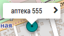

# Изменение координат объекта

Для изменения координат объекта необходимо перейти на [карту с маркером данного объекта](database-object-map.html). 

На самой карте нужно выбрать клинику нажав на название над маркером:

После чего в левом верхнем углу появится кнопка:

Нажав на нее вы переходите в режим редактирования координат объекта. 
Для изменения положения объекта необходимо нажать на карте в то место куда будет перемещен маркер данного объекта.

После этого нужно нажать на кнопку "Сохранить".
