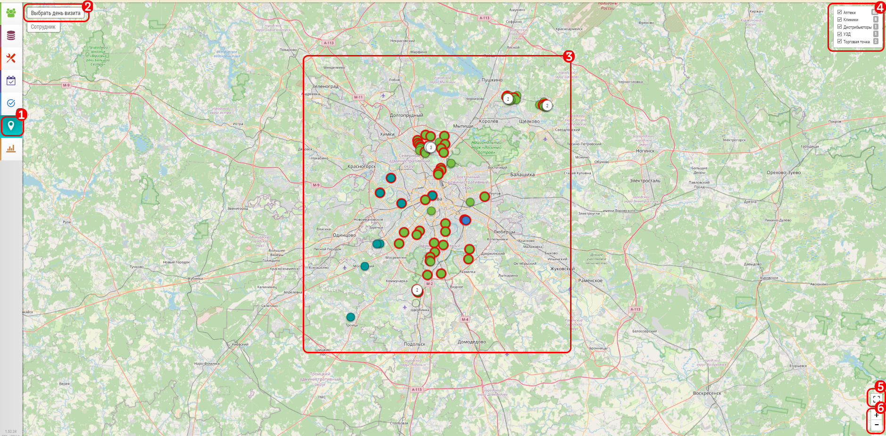

## Просмотр списка своих объектов на карте. Планирование из карты

[Просмотр объектов на карте](map.md).

Чтобы запланировать визит из карты:

- перейдите на карту [1]
- нажмите на метку интересующего вас объекта [2]. 
- выберите нужный - если в точке их несколько и нажмите на него [3]
- появится окно с краткой информацией и кнопкой добавления в план 
- нажмите на кнопку [4]
- появится стандартный интерфейс [календаря](rep-add-calendar.md) для добавления в план

Также можно нажать на кнопку [5] для [изменения координат объекта](map-change-object-latlng.md).
