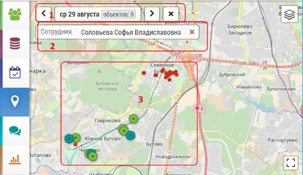

## Просмотр объектов визита и геометок пользователей (менеджер)

`Администратор, Менеджер`

Чтобы просмотреть объекты визита и геометки пользователя необходимо:

- перейти на [карту](map.html) 

- выбрать дату `1`
- выбрать сотрудника `2`

На карте `3` будут отрисованы объекты и геометки пользователя (красные точки).
 