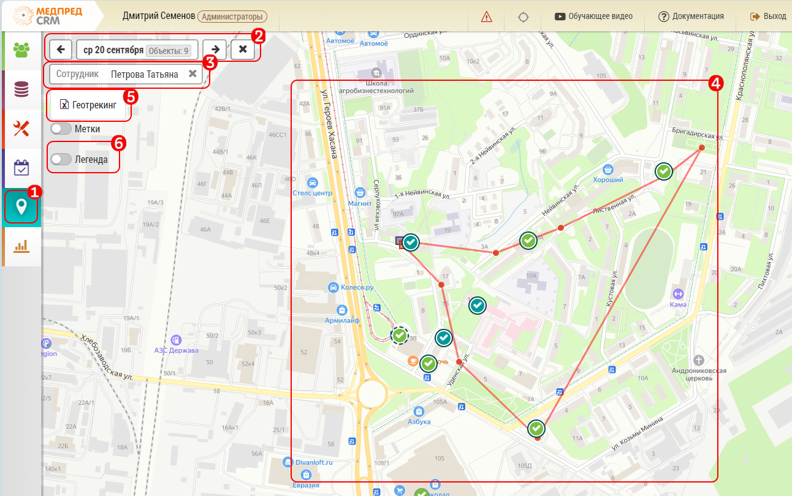

# Просмотр объектов визита и геометок пользователей (администратор)

> `Администратор`

Чтобы просмотреть объекты визита и геометки пользователя необходимо:

- перейти на [карту](map.html)  `1`

- выбрать дату `2`
- выбрать сотрудника `3`

На карте будут отрисованы объекты и геометки пользователя `4 `

Дополнительно можно выгрузить Отчет по геотрекингу `5 ` , а так же посмотреть легенду `6 `

Легенда содержит пояснения о статусах визита, значении точек и геометок:

`1` Виды точек Объектов. Можно быстро увидеть к какому типу принадлежит Объект на карте

`2`  Статусы визитов в Объекты

`3` Описание геотрекинга

В Медпред CRM есть два варианта геоверификации визита:

## Обычная геоверификация ##

 Данная геоверификация указывает на то что сотрудник в день визита находился в пределах 150 метров от объекта.

## Строгая геоверификация
Указывает, что в период завершения визита (в течении 15 минут до или после) сотрудник находился в пределах 150 метров от объекта.
Интервалы времени и расстояния могут быть настроены индивидуально.

# Статусы визитов

`1` Точка начала работы пользователя и Точка окончания работы пользователя

`2` Выполненый визит - внутри метки появится отметка о выполнении - белая галочка, так же визит который строго загеоверифицирован - отображается со сплошной цветовой каемкой.

`3` Закрытй, но геоверифицированный не строго визит.

`4`Визит не закрытый, но не имеющий геоверификацию отобразится без кружка, или с красным кружком , если в этот объект не было ни одного визита.

`5` Не состоявшийся (отмененный) визит будет выглядеть как метка объекта с крестиком внутри.

По каждой красной точке геометки можно получить дополнительные данные (а именно Время, точность снятия в метрах, устройство с которого снимались данные), как нажав на нее, так и выгрузив отчет "Геотрекинг"

 > Если у сотрудника нет визитной активности  - вы не сможете выбрать его из списка сотрудников, и данные по геометкам соответственно так же не отобразятся.

 > При выборе даты - список для выбора сотрудников будет сформирован так же на основании их визитной активности.
 