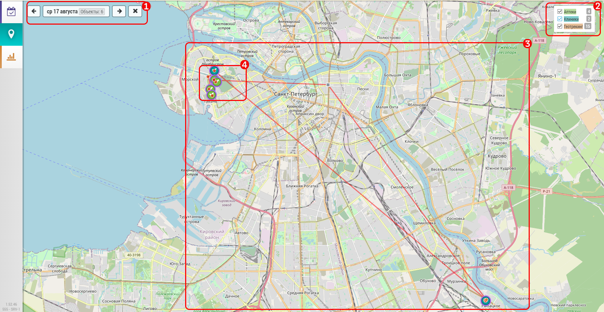

# Просмотр визитов на карте. Просмотр объектов и геометок

Для просмотра визитов на карте необходимо перейти на [карту](map.html) и выбрать нужный день `2`.
Также можно сразу перейти на карту из [подробного плана](rep-planning-full-plan.html) `3`.

- нужно выбрать день визита или изменить на нужный `1`
- при необходимости можно отфильтровать объекты по типу `2`
- на карте будут отображены объекты из плана `3`
- и геометки полученные от пользователя `4` - маленькие красные точки
