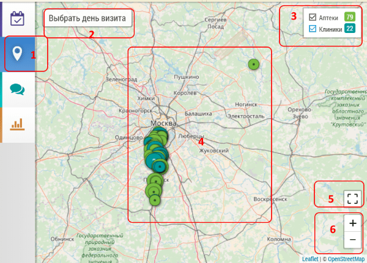

## Карта. Описание и возможности (для менеджера и пользователя)

Режим карты позволяет пользователю видеть свою базу объектов на карте.
С помощью карты можно просматривать все объекты, объекты по одному, по типу объектов.
Также на карте можно видеть план на день, и прямо с карты можно планировать визиты.
 
Менеджер на карте дополнительно может просматривать базы и планы своих подчиненных.
 
 
Основные элементы карты:

- Кнопка перехода на карту [1]. 
Кроме этой кнопки можно перейти на карту из большого количества мест нажав на геоиконку  например:

  - из списка планирования
  - из окна редактирования объекта
  - из подробного плана

- выбор дня визита [2] - для просмотра объектов в плане на конкретный день. Если день не выбран, то отображается вся база пользователя
- кнопка фильтрации объектов по типу [3] (в примере клиники/аптеки)
- объекты пользователя [4]. По нажатию на объект отображается окно, с помощью которого объект можно [добавить в план](map-planning.md)
- кнопка масштабирования [5]. Изменяет масштаб таким образом чтобы все объекты уместились на одном экране
- кнопки изменения масштаба [6]
