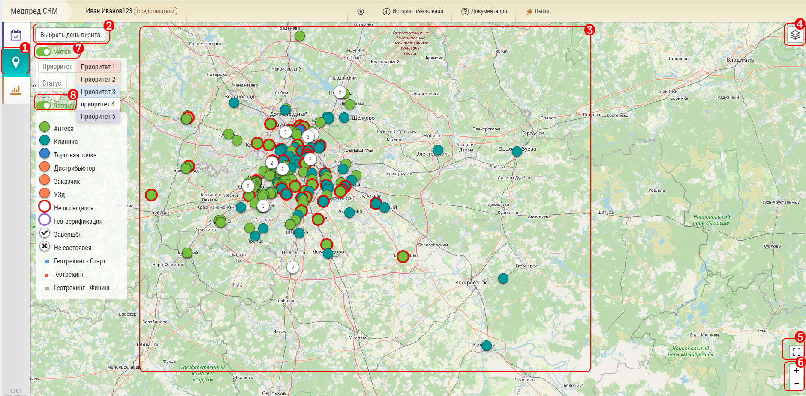

# Карта. Описание и возможности

Режим карты позволяет пользователю видеть свою базу объектов на карте.
С помощью карты можно просматривать все объекты, объекты по одному, по типу объектов.
Также на карте можно видеть план на день, и прямо с карты можно планировать визиты.
 
Менеджер на карте дополнительно может просматривать базы и планы своих подчиненных.
 
 
Основные элементы карты:

- Кнопка перехода на карту `1`. 
Кроме этой кнопки можно перейти на карту из большого количества мест нажав на геоиконку  например:

  - из списка планирования
  - из окна редактирования объекта
  - из подробного плана

- Выбор дня визита `2` - для просмотра объектов в плане на конкретный день. Если день не выбран, то отображается вся база пользователя `3`
- Объекты пользователя `3`. По нажатию на объект отображается окно, с помощью которого объект можно [добавить в план](map-planning.html)

> Красные точки - объекты, куда не было совершено ни одного визита

> Синие точки - объекты, визит в которые совершен хотя бы один раз

> Точки с цифрами сообщают что в этой точке доступно несколько объектов

- Кнопка фильтрации объектов по типу `4` (в примере клиники/аптеки/УЗД/Торговая точка)
- Кнопка масштабирования `5`. Изменяет масштаб таким образом чтобы все объекты уместились на одном экране
- Кнопки изменения масштаба `6`
