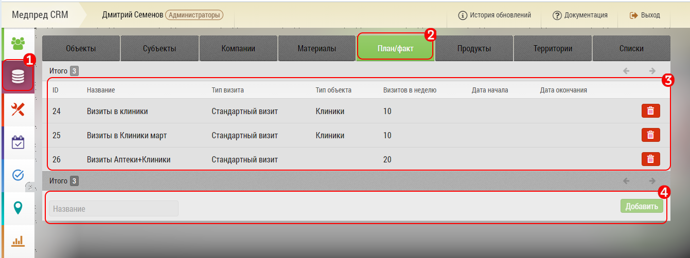
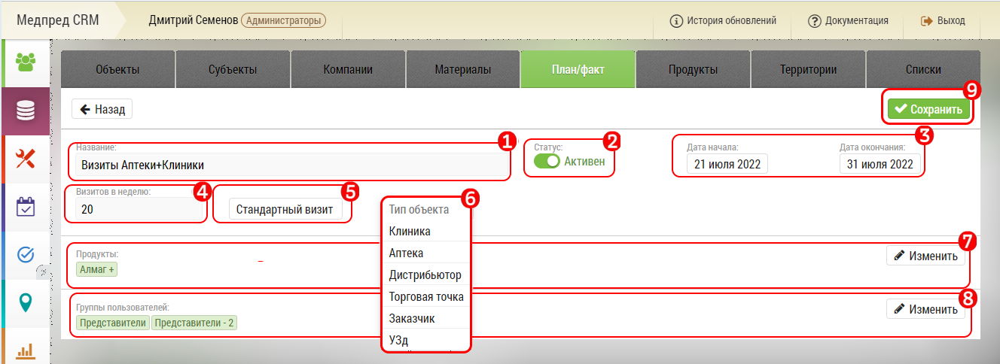
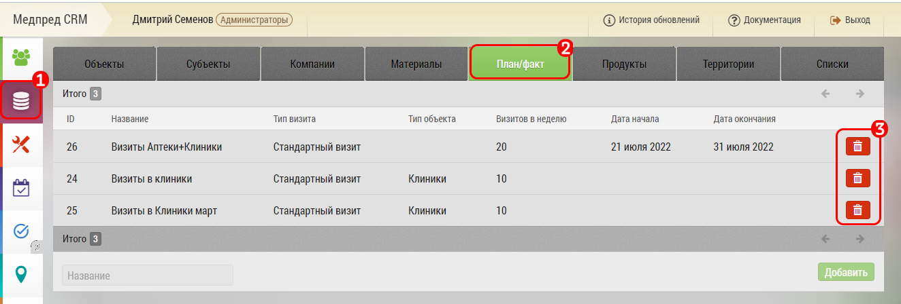

# Добавление План - факта

>`Администратор`

Добавить план-факты можно в интерфейсе "[База данных](database.html)".

Для управления план-фактами, перейдите на вкладку «База данных» `1` 

Выберите вкладку «План-Факты» `2`

Поле с план-фактами `3` 

Добавить новый план-факт ` 4 `

После того как будет занесено название план-факта, необходимо его открыть и отредактировать.

## Редактирование план-факта

Наведите курсор и нажмите на поле «Название» `1`
Вы можете в любой момент изменить название план-факта

`2` Переключатель статуса план-факта

`3` Период действия план-факта 

 > Если дата окончания не проставлена - план-факт будет действовать неограниченное количество времени.

 > Отчет по план-факту можно получить только до даты действия

 `4` Количество визитов в неделю

 `5` Выбор типа визита

 `6` Ограничение по типу объекта, в котором действует данный план-факт

 `7` Ограничение по продукту для план-факта

 `8` Выбор группы пользователей, для которой действует план-факт

Нажмите кнопку «Сохранить» `9`

 ## Удаление план-факта

 

Для удаления план-факта, перейдите на вкладку «База данных» `1` 

Выберите вкладку «План-Факты» `2`

Нажмите на кнопку "Корзина" `3` 

Подтвердите удаление план-факта:

 > Возможности восстановления план-факта после удаления - нет.

Посмотреть видео ["Добавление план-факта" ](https://storage.yandexcloud.net/support-files/video/add-plan-fact.mp4)

