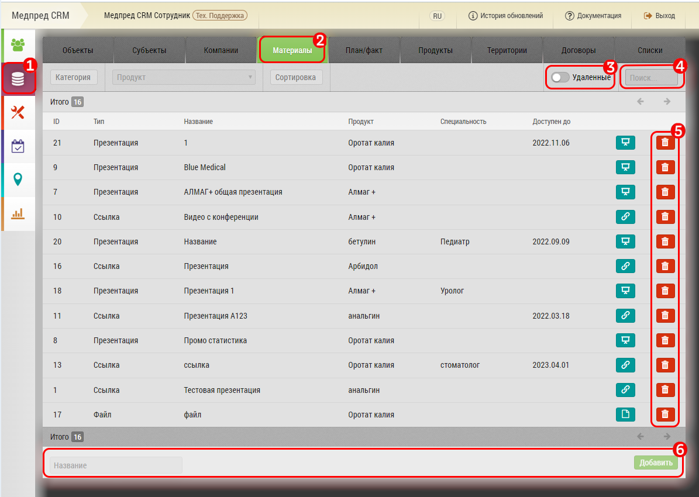
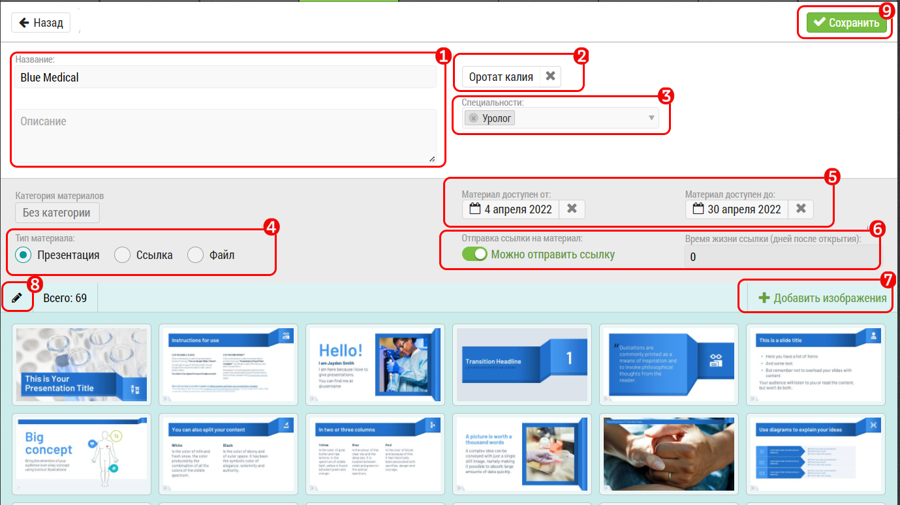

# Материалы и презентации

Презентации добавляются в режиме Менеджера и Администратора, или при наличии соответствующих прав у пользователей с доступом Материалы

"Материалы / Презентации" создаются в интерфейсе "[Управление данными](database.html)"

Чтобы добавить презнтацию нужно: 

1. Откройте раздел База данных

2. Перейдите на вкладку Материалы

3. Если нужно найти удаленные материалы, нажмите переключатель Удаленные, восстановите удаленные кнопкой «Восстановить»

4. Воспользуйтесь текстовым поиском для того, чтобы найти нужный материал

5. Кнопки удаления материалов

6. Введите в поле новое название и добавьте материал, затем отредактируйте материал.

Будет создан новый материал, который нужно отредактировать

## Редактирование материалов

Выберите из списка материалов нужный, нажмите на строку, откроется режим редактирования:

1. Отредактируйте название материала, можно заполнить поле Описание

2. При необходимости выберите продукт, который связан с презентацией

3. При необходимости выберите специальность врача, которому предназначена презентация

4. Выбрать тип материала: Презентация, ссылка или файл

5. При необходимости определите интервал доступности материала временными рамками

6. Переключатель доступности ссылки для отправки на е-мейл врачу, и сколько дней доступна ссылка (При подключении дополнительного "[Модуля маркетинговых коммуникаций](extra-share-documents.html)")

7. Добавление слайдов презентации

8. Редактирование слайдов презентации

9. Сохранение внесенных изменений

> Презентации необходимо загружать по-странично, в формате PNG или JPG

