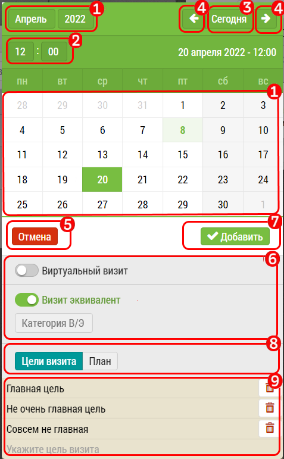

## Описание интерфейса с календарем

Календарь для выбора даты визита, кроме собственно выбора даты,
 позволяет также: 
 
  - выбирать время, 
  - указывать цели визита, 
  - видеть расписание работы врача,
  - планировать визит эквивалент 
с привязкой к объекту/субъекту - например фарм. кружок в аптеке.

В календаре: 
  1. Текущая выбранная дата. Светло зеленым - текущее число. Зеленый фон - выбранное число.
  2. Выбор времени - часов и минут - с шагом в 5 минут.
  3. Кнопка быстрого перехода календаря к сегодняшней дате.
  4. Кнопки для пролистывания месяца назад и вперед.
  5. Кнопка "отмена" - для выхода из календаря.
  6. Переключатель "Визит-Эквивалент". Служит для планирования В/Э с привязкой к объекту/субъекту.
  7. Кнопка "Добавить" - добавить визит в план. Активна когда выбрана дата.
  8. Дополнительные переключатели - для задания [целей визита](rep-add-target.md) или просмотра [режима работы врача](rep-add-schedule.md).
  9. В зависимости от переключателя 8 здесь отображается информация или о целях визита - с возможностью добавления и удаления 
  или же отображения времени работы врача - если расписание работы врача заполнено.
