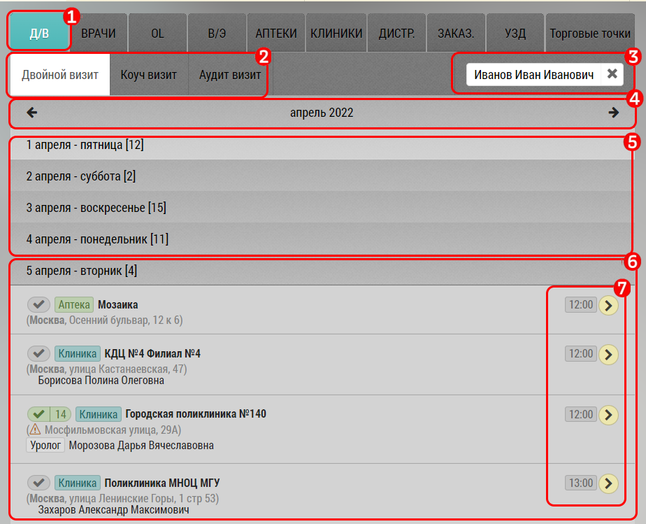

## Двойной визит - добавление в план

Чтобы добавить двойной визит в план необходимо:

  - выбрать тип визита[2], сотрудника[3] и дату[4,5]
  - выбрать день и конретный визит[6]
  - нажать на кнопку[7]  
  - для аудит визита необходимо выбрать дату визита

Двойной и Коуч визит можно запланировать только на незакрытый визит.

Аудит визит проводится по уже прошедшим визитам сотрудника.
Доступны визиты за последние 2 недели.

После добавления двойного визита в план у менеджера и сотрудника он появится в интерфейсе

