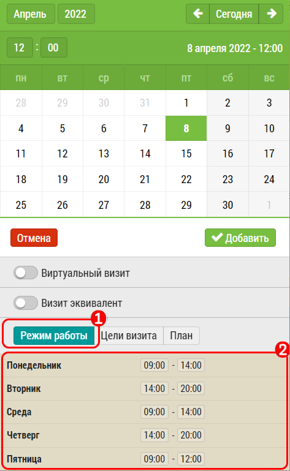

## Режим работы врача

При добавлении визита к субъекту в план, если у субъекта(врача) задано расписание, 
пользователь может видеть его и учесть при составлении плана.

 - Переключатель в положение "Режим работы" [1].
 - Расписание [2].

Задается расписание в окне редактирования субъекта [3]. 

Сам режим работы никак не влияет на возможность или невозможность добавления в план
и служит только для информирования пользователя.
