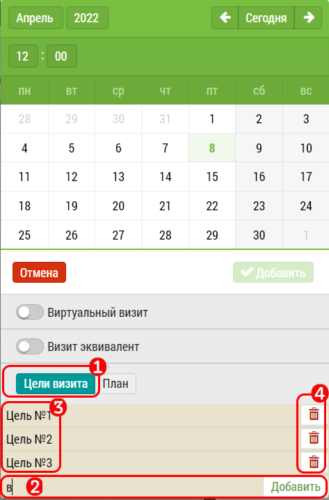

## Цели визита

Блок "цели визита" в календаре позволяет при выборе даты визита, 
занести цели визита в план.

Чтобы указать цели визита при выборе даты необходимо в интерфейсе календаря:
  1. Нажать на кнопку "Цели визита".
  2. В строку написать цель визита. Появится кнопка . 
  Нажать на нее.
  3. Цель визита добавится в список целей.
  4. Удалить "цель визита" можно с помощью кнопки "Корзина".

Позднее "цели визита" можно заполнить, изменить или удалить из интерфейса занесения итогов визита.
