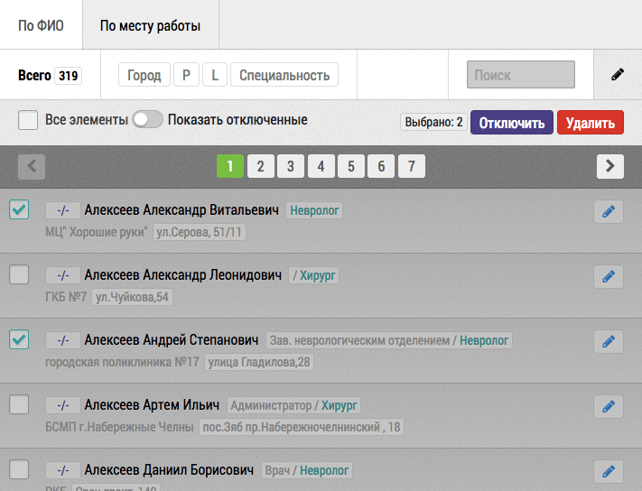

# Временное отключение врачей

Для удаления или отключения врачей из списка планирования необходимо перейти в режим редактирования. После чего можно выделить требуемые объекты (4) и отключить их нажав на соответствующую кнопку (3).После чего выбранные объекты не будут отображаться в списке планирования.

Для просмотра и/или восстановления нужно нажать на переключатель “Показать отключенные” (2). После чего по аналогии с отключением можно будет снова включить объекты.