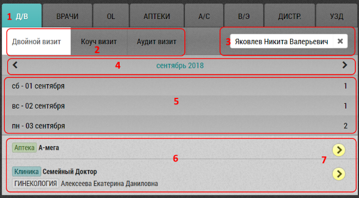

# Двойной (коуч, аудит) визит. Описание элементов интерфейса и возможностей

Двойной (коуч, аудит) визит совершает менеджер вместе или для проверки своих сотрудников.
Двойной и коуч визит совершается вдвоем - менеджер идет с сотрудником к объекту/субъекту.
Аудит визит совершается менеджером для проверки работы сотрудника на каком-либо уже закрытом предыдущем визите.

Наличие вкладки ДВ (двойной визит) зависит от группы и прав сотрудника.

Интерфейс вкладки "Двойной визит":

1. Вкладка двойной визит
2. Вкладки тип двойного визита: двойной, коуч, аудит
3. Выпадающий список сотрудников менеджера
4. Выбор месяца - с возможностью листания. Щелчок по месяцу выбирает текущий месяц
5. Доступные для выбора дни
6. Доступные для двойного визита визиты выбранного дня
7. Кнопка запланировать двойной визит
