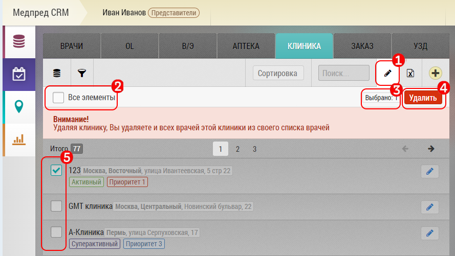

## Отключение или удаление нескольких объектов/субъектов

Чтобы отключить или удалить несколько объектов/субъектов, 
необходимо выбрать нужную вкладку (например врачи).

1. Нажать на кнопку перехода в режим редактирования.
2. Выбрать все записи.
3. Или отметить и исключить записи по одной.
4. Текущее количество отмеченных записей.
5. Нажать отключить.
6. Или удалить.

Исключенные записи можно увидеть и включить обратно с помощью переключателя 
"Показать отключенные" [7].

Удаленные записи не удаляются насовсем, пользователь с правами администратора 
может их вернуть при надобности.

**При отключении или удалении клиники вы отключаете или удаляете и всех врачей вместе с ней**
