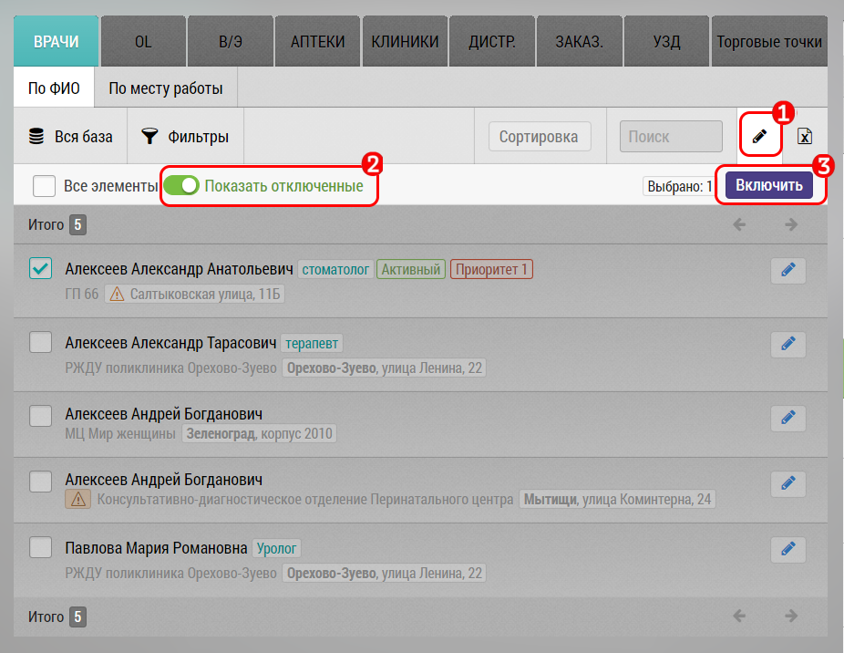

# Просмотр отключенных объектов/субъектов

Чтобы увидеть отключенные объекты/субьекты необходимо перейти в нужную вкладку (например врачи)

1. Нажать на кнопку перехода в режим редактирования
2. Нажать переключатель "Показать отключенные" и смотреть
3. При необходимости можно отметить какие то записи и включить их обратно кнопкой "Включить" 
