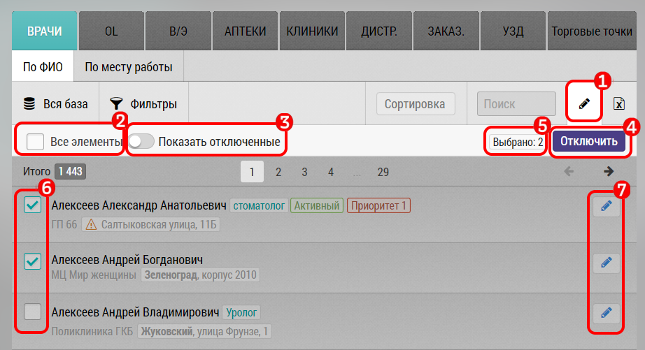

# Режим редактирования

> Режим редактирования подключается через запрос в Техподдержку, по умолчанию отключить субъекты возможности нет 

Режим редактирования предназначен для редактирования субъекта/объекта, массового отключения или удаления некорректных/ненужных/временно ненужных записей.

Для перехода в режим редактирования нажмите на карандаш `1`.
Режим редактирования отображает записи с учетом фильтров.

В режиме редактирования:
- Галочка для выбора всех записей `2` (с учетом пагинатора - т.е. в общем случае первых 50).
  При ее нажатии выделяются все записи `6` и отображается их количество
- Переключатель "Показать отключенные" `3` - чтобы переключатся между отключенными и обычными записями
- Кнопка для отключения/включения записей `4`
- Информация о количестве выбранных субъектов `5`

> Во вкладке Клиники и Аптеки, добавлена кнопка "Удалить"

> Внимание - удаляя клинику, вы удаляете и врачей этой клиники

- Галочки `6` - для индивидуального выделения/снятия выделения записи - для дальнейшей работы
- Кнопка `7` для перехода к редактированию отдельной записи - например врача или клиники
