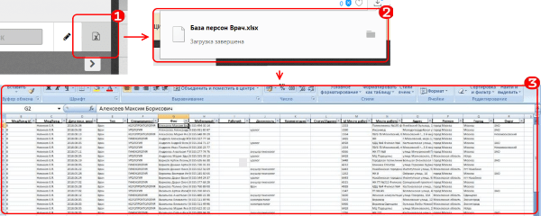

# Экспорт

Кнопка "Экспорт" центрального блока раздела "Планирование", предназначена для быстрого экспорта (без настроек) текущих выбранных записей в формат xlsx.

Для экспорта необходимо выставить фильтры в нужный режим.
Например выбрать город.

После этого
  1. Нажать на кнопку
  2. Произойдет генерация файла и его скачивание
  3. Работайте с файлом как с обычным файлом xlsx
