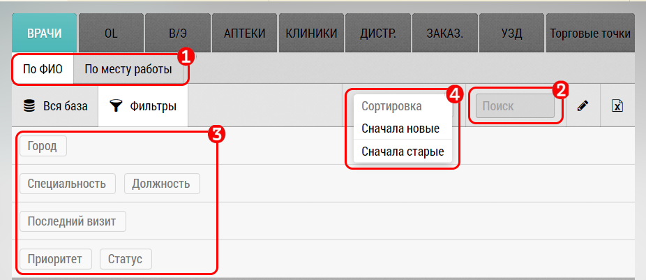

## Описание доступных фильтров

Фильтры предназачены для поиска и фильтрации записей в разделе планирования - центральный блок.

В зависимости от выбранной вкладки/типа записей/прав пользователя, могут быть доступны или недоступны различные фильтры.

Некоторые разделы - например В/Э - визит эквивалент (НеВизит) - могут вообще не иметь фильтров.

Фильтры могут быть:
  1. По ФИО/Месту работы - доступен для Субъектов (Врачей/ОЛ). 
  Эта настройка меняет режим отображения субъектов - они отображаются или по алфавиту, или сгруппированы по объекту (клинике) в которой они работают.
  2. Текстовый фильтр - фильтрует по ФИО, Названию или адресу.
  3. Фильтр по характеристикам записи 
     - для врачей:  по городу, P|L, специальности
     - для ОЛ: по статусу (федеральный, региональный), ресурсу (административный, научный)
     - для объектов - по городу, IC (внутренней), EC (внешней категории)
