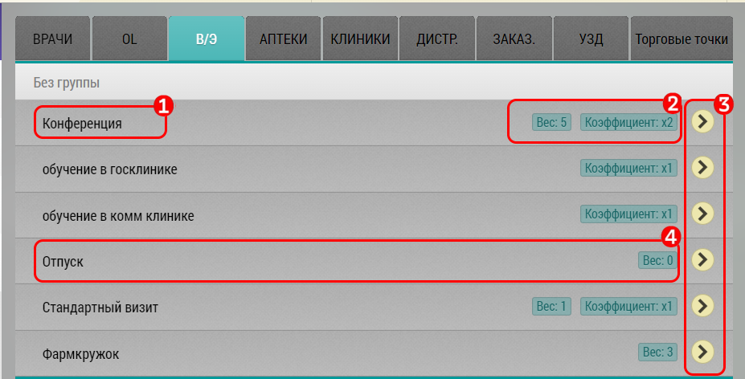

# Визит эквивалент. Описание элементов интерфейса и возможностей

Список (вкладка) В/Э (невизит) предназначена для добавления в план невизитной активности.
Это например, работа в офисе, командировки, больничные, конференции, фарм кружки и прочее (`список настраивается в режиме администрирования`).

  1. Название/содержание В/Э
  2. Количество часов
  3. Кнопка добавления в план
  4. У некоторых пунктов может не быть четкой продолжительности в часах - в этом случае там устанавливается коэффициент, и время заполняется при закрытии визита

Также стоит отметить, что В/Э может быть привязан к объекту/субъекту.
 
 
 
И в этом случае он должен заносится в план из интерфейса этого объекта/субъекта - например аптеки.
