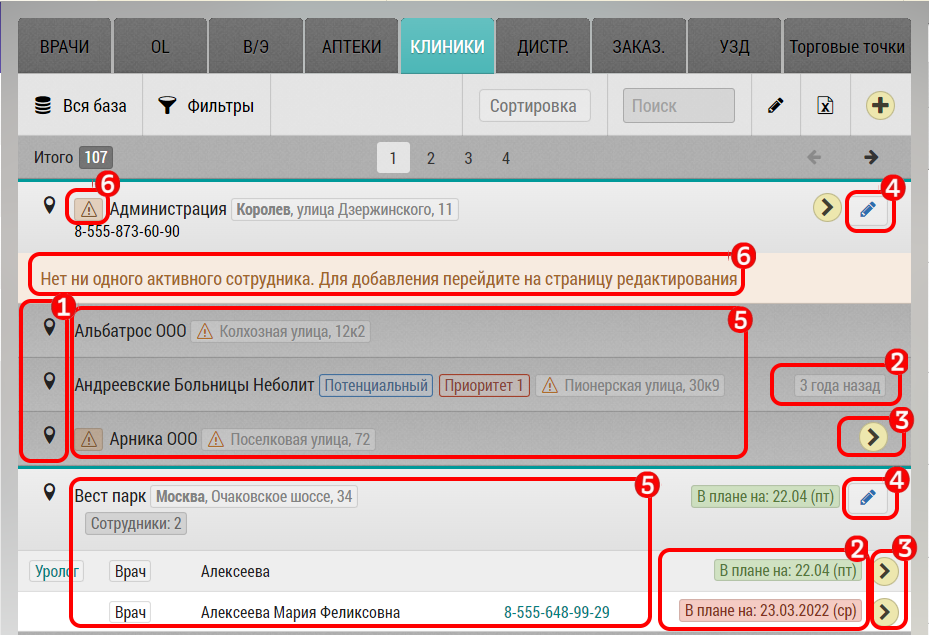

## Списки объектов (аптеки, клиники). Описание элементов интерфейса и возможностей

Список (вкладка) объектов предназначена для работы с объектами - клиниками, аптеками.

Имеет стандартные для большинства вкладок элементы управления.

[Стандартные элементы центрального окна](rep-planning-central-block.html).

Представляет из себя список клиник/аптек, других объектов.

В интерфейсе:

  1. ГеоМетка - по нажатию можно перейти в режим карты
  2. Название объекта, его адрес, дату последнего посещение, планируемого визита. Просроченный визит будет выделен красным
  3. Кнопка для добавления в план визитов
  4. Кнопка для редактирования объекта
  5. По нажатию на строку видна расширенная информация - контакт.
  Для клиник можно увидеть список врачей прикрепленных к этой клинике, с контактами 
  и возможностью запланировать визит
  6. Для клиник - если нет активных врачей - выводится предупреждающий знак и надпись
