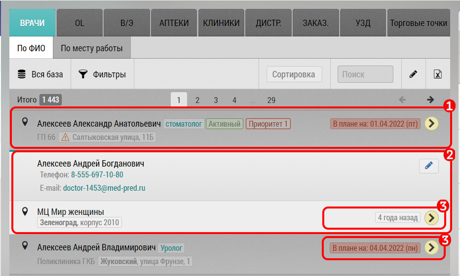

## Врачи. Список по ФИО

Режим отображения субъектов - по ФИО, предназначен для работы с врачами, ОЛ.

В этом режиме доступны [стандартные элементы центрального окна](rep-planning-central-block.md).

В этом режиме врачи отображаются по алфавиту, а не сгруппированы по клиникам.

По умолчанию врачи отображаются в виде [1].

Показаны:

  - Геометка - врач привязан к клинике с координатами - при нажатии на нее переходим к отображению на карте
  - P|L врача - в данном примере пустые
  - ФИО, специальность/специализация врача
  - Когда запланирован визит (в примере - просрочен), или же когда был последний визит к врачу [3]
  - кнопка для добавления врача в план визитов
  - основная клиника к которой врач привязан (врач м.б. привязан более чем к одной клинике)
  
При нажатии на врача используется расширенный вид [2].

В нем дополнительно отображены:

  - кнопка перехода к редактированию врача
  - контакты врача: телефон, емейл
  - клиники к которым привязан врач, с возможностью запланировать визит к врачу в конкретную клинику
