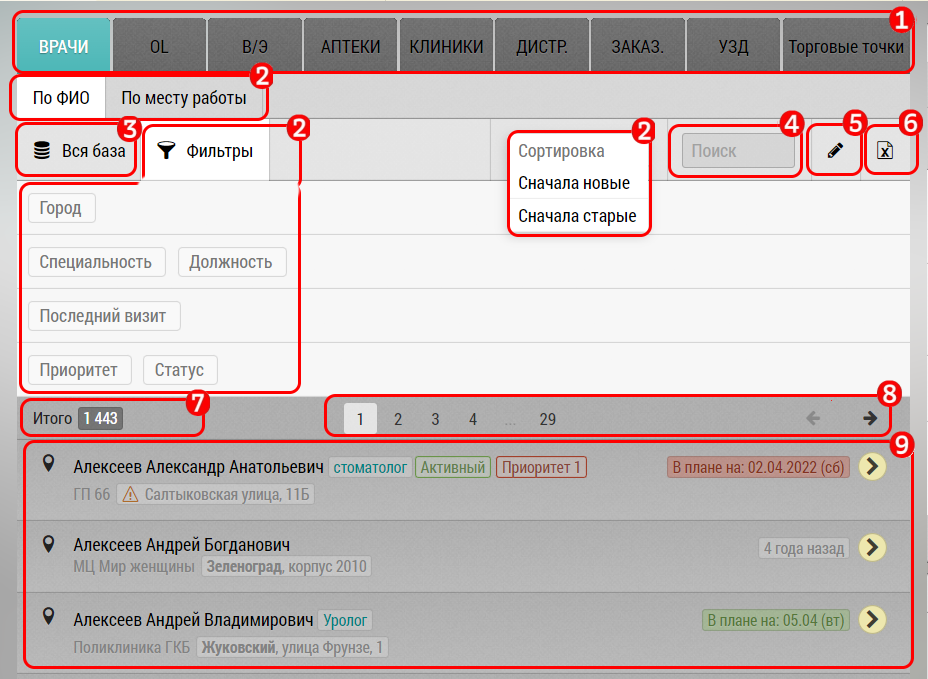

## Описание центрального блока (с вкладками)

Центральный блок в разделе "Планирование" предназначен для работы 
с базой пользователя:
  - просмотр
  - редактирование
  - занесение в план
  - отключение
  - удаление
  - фильтрация
  - экспорт
  
Он разделен по типам записей (объектов/субъектов/визитов) по вкладкам.
Количество и наличие вкладок зависит от прав выданных пользователю - от его группы.
Например, пользователь может работать только с врачами, и не работать с ОЛ и аптеками.

Если пользователь имеет права менеджера, он может иметь возможность 
выполнять двойные визиты - например обучающий или проверочный визит.

Центральный блок может состоять:
  1. Вкладки - для переключения типа текущих записей. Зависят от прав пользователя.
  2. Режим сортировки по фио/месту работы - доступно для субъектов (врачей, ОЛ)
  3. Количество записей доступных в текущих настройках записей
  4. [Набор фильтров](rep-planning-central-block-filters.md) - зависит от текущей вкладки и режима отображения
  5. Кнопка перехода в [режим редактирования/отключения/удаления](rep-planning-central-block-edit.md)
  6. Кнопка [экспорта](rep-planning-central-block-export.md) - экспортирует с учетом текущих настроек
  7. Блок пагинации - для отображения только части записей - например по 50 - включает 
  кнопки листания и прямого перехода.
  8. Отображение записей выбранной вкладки.
  9. В некоторых записях доступна кнопка создания новой записи (например клиники)

В зависимости от выбранной вкладки - типа записей - и прав пользователя 
могут быть доступны разные блоки.
