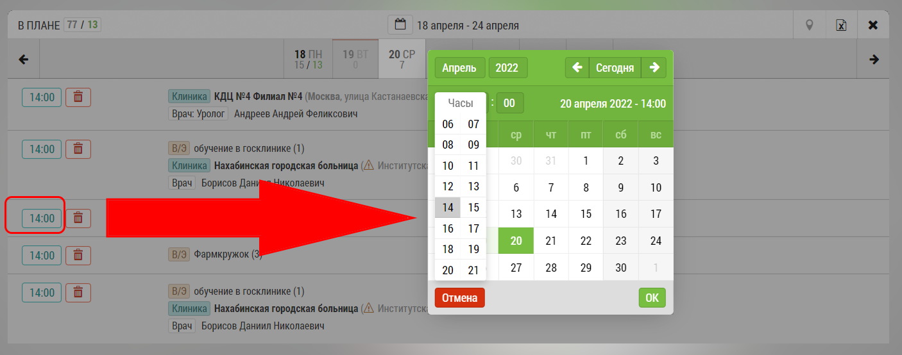

## Изменение даты визита

**Дату визита можно изменить только у незакрытого визита**

Чтобы изменить дату визита, необходимо перейти в подробный план,
найти строку с этим визитом, и нажать там на кнопку с временем визита.

Откроется календарь с выбором даты и времени визита.

После выбора или изменения даты и времени необходимо 
нажать на галочку чтобы подтвердить изменение
или крестик чтобы отменить.
В обоих случаях календарь закроется и вы вернетесь к подробному плану.

При изменении даты строка с визитом пропадет из текущего отображения 
и будет показываться в нововыбранной дате.
