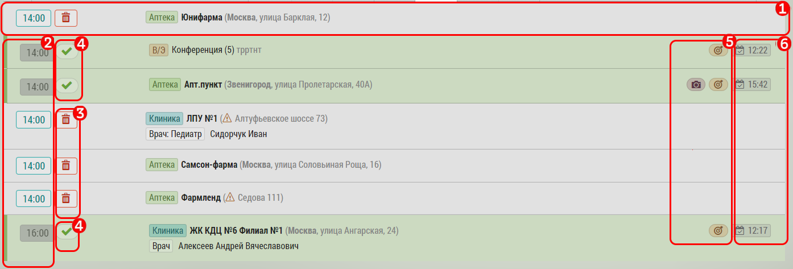

## Описание страницы "Подробный план"

Страница "Подробный план" предназначена для того, чтобы сотрудник мог в подробностях видеть свои прошедшие, текущие и будущие визиты.

>Эта страница является основной для работы с запланированными визитами на выезде.

На странице можно менять дату визита, отменять визит, перейти к редактированию и закрытию визита.
В целом подробный план соответствует краткому плану, но предоставляет расширенные возможности и информацию.

Интерфейс "Подробный план" состоит из двух частей.

Общая часть:

 1. Количество часов в плане на неделю
 2. Текущий выбранный период. При щелчке переходим к текущей неделе
 3. Перейти к плану выбранного дня на карте
 4. Выгрузка плана выбранной недели в excel
 5. Перелистнуть на неделю назад или вперед
 6. Выбранный день - с указанием количества часов
 7. Отметка текущей даты

И визиты выбранного дня: 

 1. Строка с информацией об отдельном визите. 
 Время, статус, объект/субъект, информация.
 По нажатию на строку переходим к редактированию/просмотру/закрытию визита
 2. Запланированное время визита: 
  для незакрытого визита - 
 по нажатию можно изменить [дату визита](rep-planning-full-plan-change-date.md),
  для закрытого - информация о времени визита
 3. Корзина - удалить визит из плана
 4. Галочка - означает что визит закрыт
 5. Иконки статуса визита: 
    - Фотоаппарат - у визита есть прикрепленные фото
    - Мишень - означает что у визита проставлена цель
    - ГеоМетка - визит геоверифицирован
 
Фон строки визита означает:

- красный фон - просроченный визит (с датой визита от вчера или ранее)
- зеленый - выполненный
- серый - текущий - не просроченный и не выполненный
