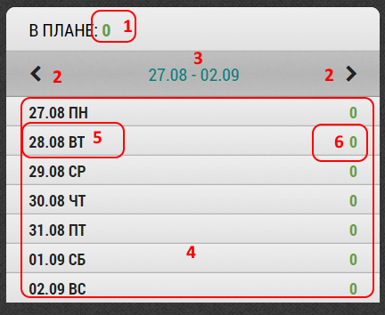
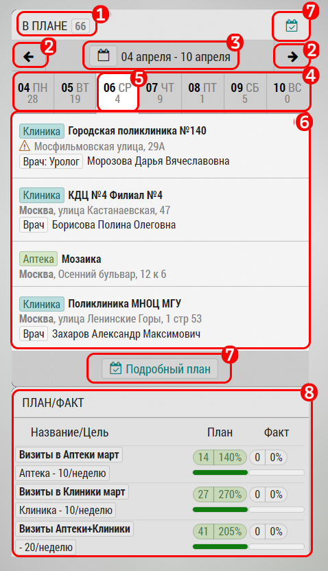

## Планирование. Описание блока "Краткий план"

Блок "Краткий план" предназначен для того, 
чтобы сотрудник мог оперативно видеть свои текущие, 
прошедшие и будущие визиты во время планирования.

На "Кратком плане":

 1. Количество часов в плане на неделю
 2. Перелистнуть на неделю назад или вперед
 3. Текущий выбранный период. При щелчке переходим к текущей неделе
 4. Неделя по дням
 5. Один день из недели - при нажатии переходим к этому дню в 
 [подробном плане](rep-planning-full-plan.md)
 6. Количество часов в плане на этот день
   

Информация в визите:
- Тип объекта/субъекта (аптека, клиника, невизит...)
- Название
- Адрес (город, округ)
- Субъект или контакт
- Отметки о выполненном визите, геоверификации визита
