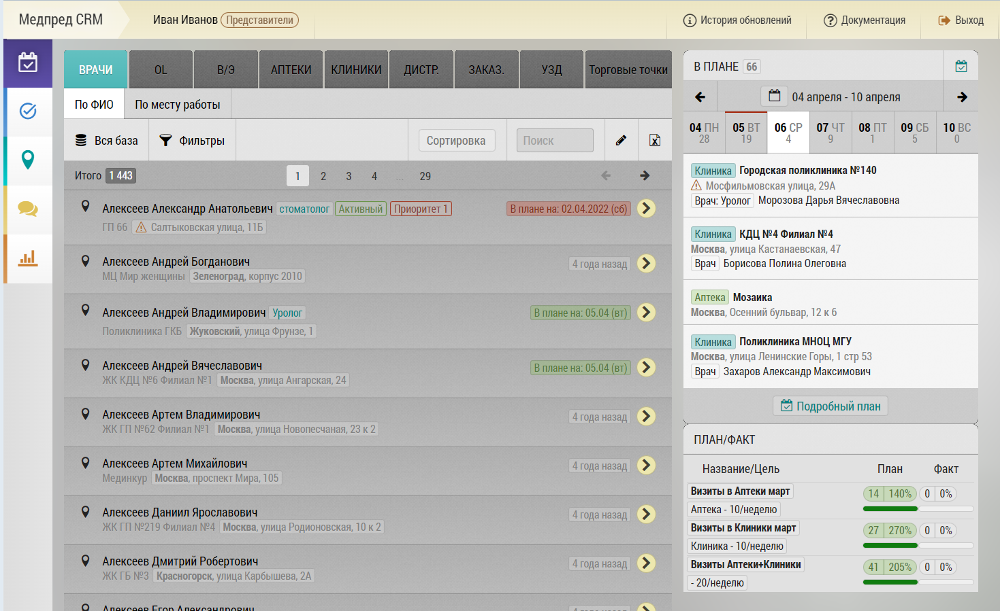

# Планирование. Описание элементов (блоков) интерфейса и возможностей

Этот экран является одним из основных для планирования визитов.
Служит для просмотра и редактирования базы пользователя, составления и просмотра плана.

 

Состоит из следующих частей:
- [Центральный блок с вкладками с объектами/субъектами для планирования](rep-planning-central-block.html)
  - Вкладки для переключения между типами объектов/субъектов планирования 
  (количество и доступность зависят от настроек пользователя)
  - Панели управления по текущей выбранной вкладке
  - Блок Пагинации
  - Список ваших объектов/субъектов по выбранной вкладке
- [Блок краткого плана на неделю](rep-planning-short-plan.html) с возможностью листать недели вперед и назад

Панель управления зависит от выбранной вкладки.
На ней могут быть размещены следующие элементы:
- Количество
- [Различные фильтры](rep-planning-central-block-filters.html)
- Переход в [режим редактирования](rep-planning-central-block-edit.html) списка объектов/субъектов
- Быстрая [выгрузка текущей базы в Excel](rep-planning-central-block-export.html) (с учетом текущих фильтров)
- Добавление объекта/субъекта планирования в свою базу

Блок краткого плана служит для быстрого просмотра запланированных или уже выполненных визитов и перехода к [подробному плану](rep-planning-full-plan.html).
В нем отображаются объекты/субъекты, их количество, даты.

Посмотреть видео ["Планирование визитов" ](https://med-pred.ru/storage/videos/May2023/U30PuDX76lk1FBEvqn2x.mp4)
