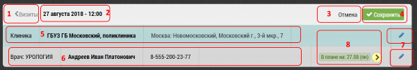
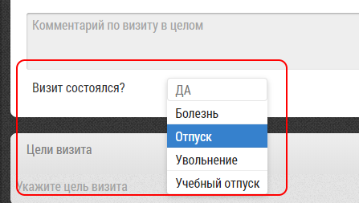
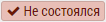

## Отмена визита (несостоявшийся визит)

Иногда визит не состоялся по не зависящим от пользователя причинам.
Например врач к которому он шел заболел, ушел в отпуск и т.п.

Чтобы показать, что пользователь к врачу ходил введено понятие "несостоявшийся визит".

Для того чтобы отметить визит как несостоявшийся необходимо в блоке итогов визита [3]

Выбрать причину в графе "визит состоялся" и сохранить визит.

По умолчанию там поставлено "Да".

`Список возможных причин задается администратором, в разделе 
"База Данных" -> "Списки" -> "Причины отмены визита".`

Несостоявшийся визит помечается меткой 
