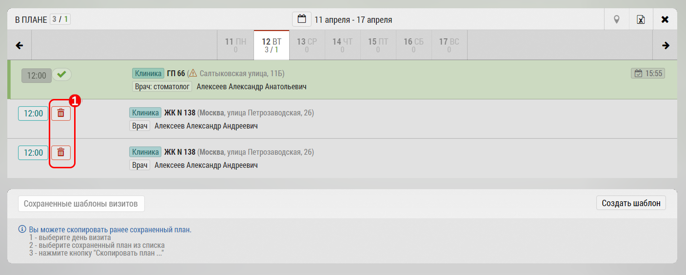
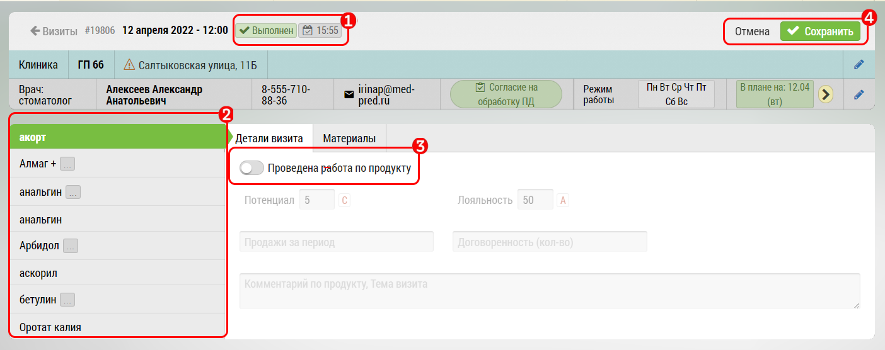

# Удаление визита 

Удалить можно любой незакрытый визит, в Длинном плане нажав на кнопку "Корзина" `1`

Если визит закрыт, и напротив появилась зеленая галочка, то при наличии разрешения, вы сможете его так же удалить:

Для этого нужно:

1. Убедиться что визит действительно закрыт
2. Перейти в Продукты, выбрать продукт по которому проведена работа
3. Отключить "Проведена работа по препарату"
4. Сохранить

Визит станет не закрытым, и его можно будет удалить в Длинном плане
