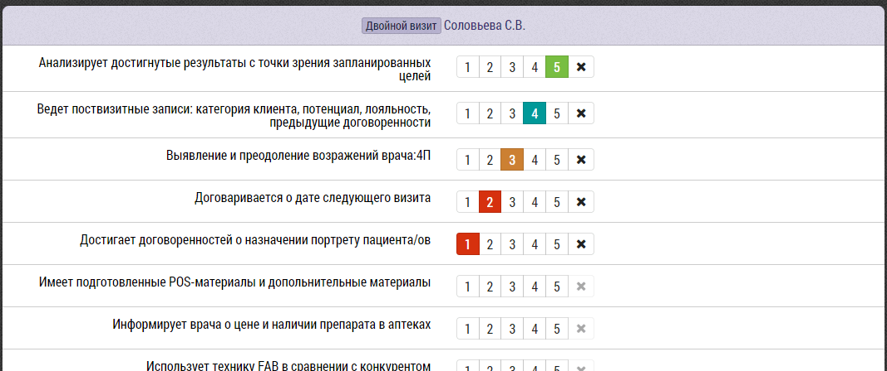

# Итоги двойных визитов

Интерфейс занесения итогов двойного визита содержит, как [общие для всех итогов визита](rep-visits.html) блоки, так и отличающиеся.

Двойной визит доступен только менеджерам, у которых есть сотрудники.
Менеджер оценивает сотрудника по критериям по пятибальной шкале.

Чтобы выставить оценку нужно щелкнуть по цифре от 1 до 5.
Чтобы не оценивать сотрудника по какому либо критерию или убрать уже выставленную оценку,
нужно нажать на "X".

Если Критерии не заданы будет написано:

`Не заданы критерии оценки. Критерии задаются на странице управления данными, вкладка: "Списки"`

`Список критериев задается администратором, в разделе "База Данных" -> "Списки" -> "Критерии: Двойной Визит", 
"Критерии: Коуч Визит", "Критерии: Аудит Визит".`