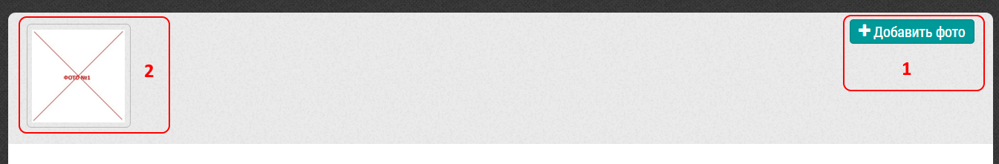

# Добавление фото

К любому визиту можно добавить фотографии.
Их нужно сделать отдельно, и в программе выбирать из уже готовых.

  1. Кнопка "Добавить фото" - выбрать фото из находящихся на компьютере/планшете - через стандартный интерфейс ОС. Либо сфотографировать и загрузить фото в программу

  2. Кнопка редактирования фото

  3. Кнопка, позволяющая инвертировать фото

  4. Кнопка удаления фото

  5. Уже добавленные фотографии - по щелчку на фото можно перейти к крупному изображению

> Поддерживается только формат jpg
