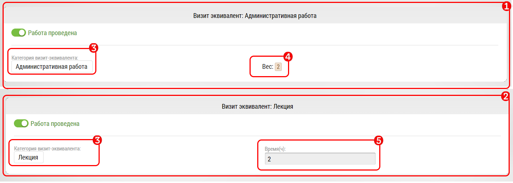

# Итоги визит эквивалента

Интерфейс занесения итогов визит-эквивалента (В/Э) содержит меньше блоков чем другие.
В интерфейсе есть как [общие для всех итогов визита](rep-visits.html) блоки, так и индивидуальные.

Если визит эквивалент указан без привязки к объекту/субъекту, соответственно не будет блока информации/редактирования объекта/субъекта.

Блок итогов Визит Эквивалента в зависимости от типа Визит Эквивалента может быть двух видов:

  1. С фиксированным количеством часов
  2. С коэффициентом перевода 

В обоих случаях есть Выбор вида В/Э `3`.

В случае фиксированных часов они просто отображаются `4`.
В случае коэффициента нужно ввести время `5`, оно перемножится на коэффициент `6` и число часов В/Э будет в графе `7`.

> В/Э с коэффициентом нельзя закрыть, если время проставлено 0, о чем будет указано при сохранении
