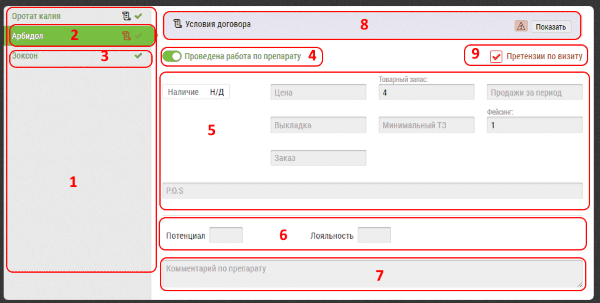

# Итоги визита в объект (аптеку). Описание интерфейса

Интерфейс занесения итогов визита в объект (аптеку) содержит, как [общие для всех итогов визита](rep-visits.html) блоки, так и отличающиеся.

Блок занесения итогов визита в объект (аптеку) содержит:

1. Поле со списком препаратов
2. Текущий препарат - зеленый фон
3. Зеленая галочка - данные по препарату заполнены
4. Переключатель - "Проведена работа по препарату" - именно по нему определяется с какими именно препаратами работал пользователь на этом визите
5. Набор полей для заполнения - такие как цена, запас, заказ, наличие
6. Показатели потенциала - лояльности по препарату - имеют как цифровое, так и буквенное обозначения соответствующее диапазону (настраивается администратором)
7. Комментарий по конкретному препарату - 
**не путать с комментарием по визиту в целом**

> Чтобы закрыть визит необходимо провести работу хотя бы по одному препарату.
