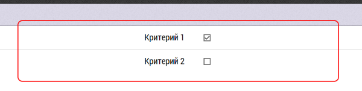

## Итоги визита к ОЛ

Интерфейс занесения итогов визита к субъекту (ОЛ) содержит, 
как [общие для всех итогов визита](rep-visits.md) блоки, так и отличающиеся.

В отличии от итогов визита, например к врачу, ОЛ не имеют заранее заданных в программе данных.
Их должен задать администратор при первоначальной настройке базы.

Например критериями могут быть:
  - знание препарата, 
  - коммуникабельность, 
  - умение заинтересовать врача.

Если критерии не заданы то при переходе к окну заполнения итогов визита к ОЛ, 
будет следующая надпись: 

`Не заданы критерии оценки. Критерии задаются на странице управления данными, вкладка: "Списки"`

В этом случае следует обратиться к администратору, чтобы критерии были занесены в базу данных.

Соответсвенно после заполнения списка критериев, пользователь видит эти критерии,
и может проставить галочку напротив каждого критерия.
